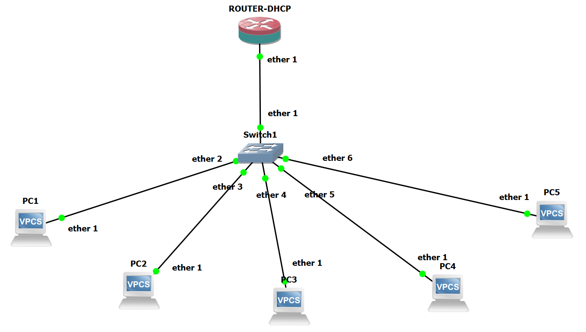
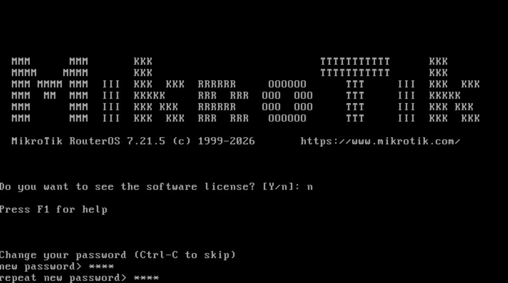
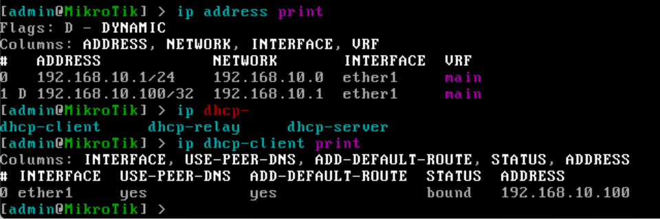
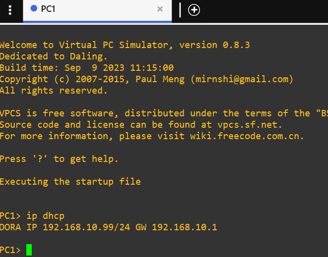
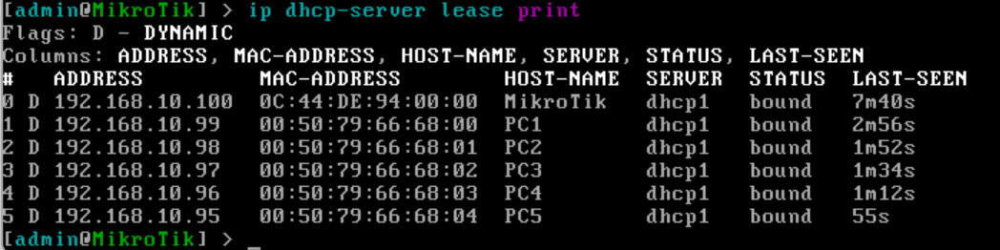

# Lab 01 — Konfigurasi DHCP Server pada MikroTik (GNS3)

## 1. Tujuan

Mengonfigurasi MikroTik sebagai DHCP Server agar dapat membagikan alamat IP, gateway, dan DNS secara otomatis kepada client di jaringan lab.

Perangkat yang dipakai: 1 router MikroTik, 1 switch, dan 5 VPCS sebagai client.

## 2. Topologi



| Dari | Ke |
| --- | --- |
| ROUTER-DHCP `ether1` | Switch1 `ether1` |
| Switch1 `ether2` | PC1 |
| Switch1 `ether3` | PC2 |
| Switch1 `ether4` | PC3 |
| Switch1 `ether5` | PC4 |
| Switch1 `ether6` | PC5 |

## 3. Informasi Umum

| Item | Nilai |
| --- | --- |
| Versi RouterOS | 7.21.5 |
| Interface DHCP | `ether1` |
| IP Gateway Router | `192.168.10.1/24` |
| Range IP Pool | `192.168.10.10` – `192.168.10.100` |
| DNS Server | `8.8.8.8` |
| Lease Time | 1 hari (`1d`) |

## 4. Persiapan Awal — Keamanan Router

Saat pertama kali login, RouterOS meminta password baru. Password default diganti terlebih dahulu untuk mencegah akses tidak sah, meskipun ini hanya lab.



## 5. Konfigurasi DHCP Server

Perintah dijalankan berurutan di terminal MikroTik. Versi lengkapnya ada di [`configs/dhcp-server.rsc`](configs/dhcp-server.rsc).

**a. Memberi IP pada interface**

```routeros
/ip address add address=192.168.10.1/24 interface=ether1
```

Memasang IP statis `192.168.10.1/24` pada `ether1`. IP ini menjadi gateway bagi client.

**b. Membuat pool alamat IP**

```routeros
/ip pool add name=dhcp_pool ranges=192.168.10.10-192.168.10.100
```

Menentukan rentang IP (`dhcp_pool`) yang boleh dipinjamkan ke client, yaitu `192.168.10.10` sampai `192.168.10.100`.

**c. Membuat DHCP server**

```routeros
/ip dhcp-server add name=dhcp1 interface=ether1 address-pool=dhcp_pool lease-time=1d
```

Membuat instance DHCP server bernama `dhcp1`, diikat ke `ether1` dan pool `dhcp_pool`, dengan masa sewa 1 hari.

**d. Menentukan informasi jaringan untuk client**

```routeros
/ip dhcp-server network add address=192.168.10.0/24 gateway=192.168.10.1 dns-server=8.8.8.8
```

Menentukan gateway dan DNS server yang dikirim ke client bersamaan dengan alamat IP.

## 6. Verifikasi di Router

```routeros
/ip address print
/ip dhcp-client print
```



Hasilnya:

- IP `192.168.10.1/24` sudah terpasang pada `ether1`.
- Ada DHCP client aktif di `ether1` dengan status `bound` dan alamat `192.168.10.100` (lihat [catatan](#catatan-router-ikut-mendapat-ip-dari-dhcp-server-nya-sendiri) di bawah).

## 7. Pengujian dari Sisi Client (VPCS)

Perintah di console VPCS (PC1):

```
ip dhcp
```



Hasil:

```
DORA IP 192.168.10.99/24 GW 192.168.10.1
```

PC1 mendapat IP `192.168.10.99/24` dan gateway `192.168.10.1`, sesuai range pool yang dikonfigurasi.

## 8. Verifikasi Akhir di Router

```routeros
/ip dhcp-server lease print
```



| Address | Host-name | MAC address |
| --- | --- | --- |
| 192.168.10.100 | MikroTik | 0C:44:DE:94:00:00 |
| 192.168.10.99 | PC1 | 00:50:79:66:68:00 |
| 192.168.10.98 | PC2 | 00:50:79:66:68:01 |
| 192.168.10.97 | PC3 | 00:50:79:66:68:02 |
| 192.168.10.96 | PC4 | 00:50:79:66:68:03 |
| 192.168.10.95 | PC5 | 00:50:79:66:68:04 |

Kelima PC mendapat IP dari `dhcp1` dengan status `bound`.

## Catatan: router ikut mendapat IP dari DHCP server-nya sendiri

Pada daftar lease, alamat `192.168.10.100` bukan milik PC, melainkan milik router itu sendiri (host-name `MikroTik`). Penyebabnya, router punya DHCP client aktif di `ether1` (terlihat di bagian 6), sehingga ia meminjam IP dari DHCP server yang ia jalankan sendiri.

Hal ini tidak merusak lab, tapi memakai satu alamat dari pool dan menambah alamat dinamis yang tidak perlu di router. Kalau ingin menghapusnya:

```routeros
/ip dhcp-client remove [find]
```

## 9. Kesimpulan

DHCP Server pada MikroTik berhasil dikonfigurasi dan diverifikasi. Router membagikan IP address, gateway, dan DNS secara otomatis kepada 5 client VPCS di jaringan lab GNS3.
