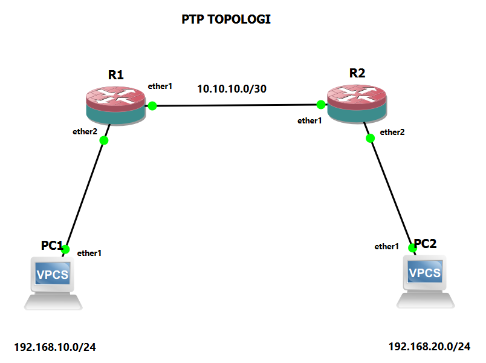
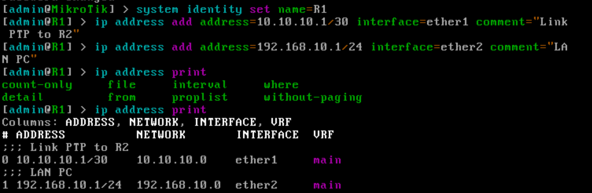
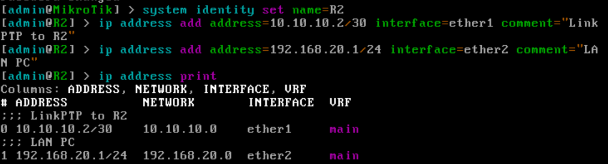
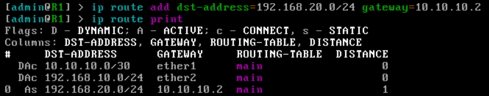
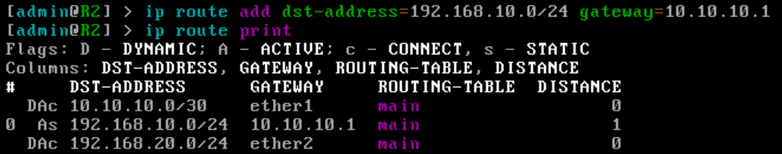
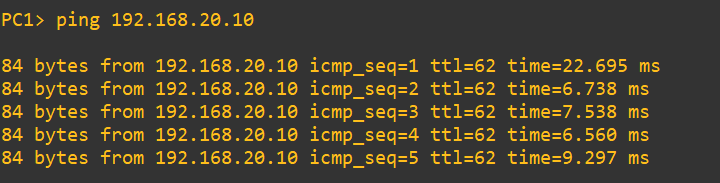
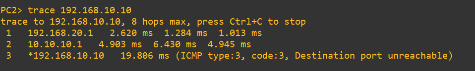

# Lab 02 — Link Point-to-Point dan Static Route pada MikroTik (GNS3)

## 1. Tujuan

Menghubungkan dua router MikroTik lewat link point-to-point (PtP) dengan subnet /30, lalu memakai static route agar dua jaringan LAN yang berbeda bisa saling berkomunikasi.

Perangkat yang dipakai: 2 router MikroTik (R1 dan R2) dan 2 VPCS (PC1 dan PC2).

> Konfigurasi dilakukan lewat console GNS3. Akses via Winbox dibahas di lab tersendiri.

## 2. Topologi



| Dari | Ke |
| --- | --- |
| R1 `ether1` | R2 `ether1` (link PtP) |
| R1 `ether2` | PC1 |
| R2 `ether2` | PC2 |

## 3. Rencana Alamat

| Perangkat | Interface | Alamat | Keterangan |
| --- | --- | --- | --- |
| R1 | ether1 | 10.10.10.1/30 | Link PtP ke R2 |
| R1 | ether2 | 192.168.10.1/24 | Gateway LAN PC1 |
| R2 | ether1 | 10.10.10.2/30 | Link PtP ke R1 |
| R2 | ether2 | 192.168.20.1/24 | Gateway LAN PC2 |
| PC1 | eth0 | 192.168.10.10/24 | Gateway 192.168.10.1 |
| PC2 | eth0 | 192.168.20.10/24 | Gateway 192.168.20.1 |

Link antar router memakai subnet /30 karena hanya membutuhkan dua alamat host (satu untuk tiap router). Ini praktik umum untuk link PtP di jaringan ISP, supaya alamat IP tidak terbuang.

## 4. Informasi Umum

| Item | Nilai |
| --- | --- |
| Versi RouterOS | 7.21.5 |
| Jaringan link PtP | `10.10.10.0/30` |
| LAN R1 | `192.168.10.0/24` |
| LAN R2 | `192.168.20.0/24` |
| Metode routing | Static route |

## 5. Konsep Singkat

Sebuah router hanya otomatis tahu jaringan yang menempel langsung pada interface-nya (*connected route*, flag `DAC` di routing table). Jaringan di seberang router lain harus diberi tahu lewat static route.

Di lab ini R1 hanya tahu `10.10.10.0/30` dan `192.168.10.0/24`, sedangkan R2 hanya tahu `10.10.10.0/30` dan `192.168.20.0/24`. Agar kedua LAN bisa saling menjangkau, masing-masing router perlu satu static route ke LAN milik lawannya, dan route itu harus ada **di kedua arah**.

## 6. Konfigurasi

Perintah dijalankan di terminal MikroTik masing-masing router. Versi lengkapnya ada di [`configs/r1.rsc`](configs/r1.rsc) dan [`configs/r2.rsc`](configs/r2.rsc).

### a. Router R1

**Nama router dan IP address**

```routeros
/system identity set name=R1
/ip address add address=10.10.10.1/30 interface=ether1 comment="Link PtP ke R2"
/ip address add address=192.168.10.1/24 interface=ether2 comment="LAN PC1"
```

Perintah `identity` mengganti nama router, dan `comment` memberi keterangan pada tiap IP. Keduanya tidak wajib, tapi membuat prompt dan daftar IP lebih mudah dibaca.

**Static route ke LAN R2**

```routeros
/ip route add dst-address=192.168.20.0/24 gateway=10.10.10.2 comment="Ke LAN R2"
```

Artinya: untuk mencapai `192.168.20.0/24`, kirim paket ke `10.10.10.2` (alamat R2 di link PtP).

### b. Router R2

**Nama router dan IP address**

```routeros
/system identity set name=R2
/ip address add address=10.10.10.2/30 interface=ether1 comment="Link PtP ke R1"
/ip address add address=192.168.20.1/24 interface=ether2 comment="LAN PC2"
```

**Static route ke LAN R1**

```routeros
/ip route add dst-address=192.168.10.0/24 gateway=10.10.10.1 comment="Ke LAN R1"
```

Artinya: untuk mencapai `192.168.10.0/24`, kirim paket ke `10.10.10.1` (alamat R1 di link PtP).

### c. Client (VPCS)

Alamat di VPCS diatur manual, tanpa DHCP, supaya fokus lab tetap ke routing.

```
PC1> ip 192.168.10.10/24 192.168.10.1
PC2> ip 192.168.20.10/24 192.168.20.1
```

## 7. Verifikasi

### a. IP address di router

```routeros
/ip address print
```

**R1**



**R2**



### b. Routing table

```routeros
/ip route print
```

Pada hasilnya akan terlihat dua jenis route: route otomatis (flag `DAC`) untuk jaringan yang menempel langsung, dan route statis (flag `S`) yang baru ditambahkan.

**R1**



**R2**



### c. Ping antar PC

Ping dari PC1 ke PC2:

```
PC1> ping 192.168.20.10
```



Ping berhasil di kedua arah, yang menandakan route di R1 dan R2 sudah benar.

### d. Trace jalur paket

Dari PC2 ke PC1:

```
PC2> trace 192.168.10.10
```

Hasilnya:

```
trace to 192.168.10.10, 8 hops max, press Ctrl+C to stop
 1   192.168.20.1   2.620 ms  1.284 ms  1.013 ms
 2   10.10.10.1   4.903 ms  6.430 ms  4.945 ms
 3   *192.168.10.10   19.806 ms (ICMP type:3, code:3, Destination port unreachable)
```



| Hop | Alamat | Artinya |
| --- | --- | --- |
| 1 | 192.168.20.1 | Gateway PC2 (`ether2` R2) |
| 2 | 10.10.10.1 | R1, lewat link PtP |
| 3 | 192.168.10.10 | PC1, tujuan tercapai |

Pesan `Destination port unreachable` di hop terakhir **bukan error**. Trace di VPCS mengirim paket UDP ke port acak yang tinggi. Saat paket tiba di PC1, tidak ada program yang mendengarkan di port itu, sehingga PC1 membalas dengan ICMP *port unreachable*. Balasan tersebut justru bukti bahwa paket sudah sampai di host tujuan.

## 8. Percobaan Tambahan: Route Hanya Satu Arah

Percobaan ini menunjukkan kenapa route harus ada di kedua arah.

1. Hapus route di R2:

   ```routeros
   /ip route remove [find dst-address=192.168.10.0/24]
   ```

2. Ping dari PC1 ke PC2. Paket dari PC1 sampai ke PC2, tapi R2 tidak tahu jalan kembali ke `192.168.10.0/24`, sehingga balasan tidak sampai dan ping gagal.
3. Pasang kembali route di R2 (perintah di bagian 6b), lalu ping lagi. Ping kembali berhasil.

## 9. Troubleshooting

| Gejala | Kemungkinan penyebab | Cek |
| --- | --- | --- |
| Ping ke gateway PC sendiri gagal | IP di VPCS atau di router salah | `show ip` di VPCS dan `/ip address print` di router |
| Ping antar router (10.10.10.1 dan 10.10.10.2) gagal | Salah interface atau subnet link | Pastikan keduanya di `ether1` dan sama-sama `/30` |
| PC1 hanya bisa ping R1, tidak bisa ping PC2 | Static route belum ada atau salah | `/ip route print` di kedua router |
| Ping satu arah berhasil, arah sebaliknya gagal | Route hanya ada di satu router | Tambahkan route di router yang satunya |
| Gateway route salah ketik | `gateway` mengarah ke IP yang bukan tetangga | Gateway harus alamat router lawan di link PtP |

## 10. Kesimpulan

Dua router MikroTik berhasil dihubungkan lewat link PtP `10.10.10.0/30`. Dengan static route di kedua router, LAN `192.168.10.0/24` dan `192.168.20.0/24` bisa saling berkomunikasi. Lab ini menjadi dasar untuk lab berikutnya yang menambah router dan layanan di atas jaringan yang sama.
