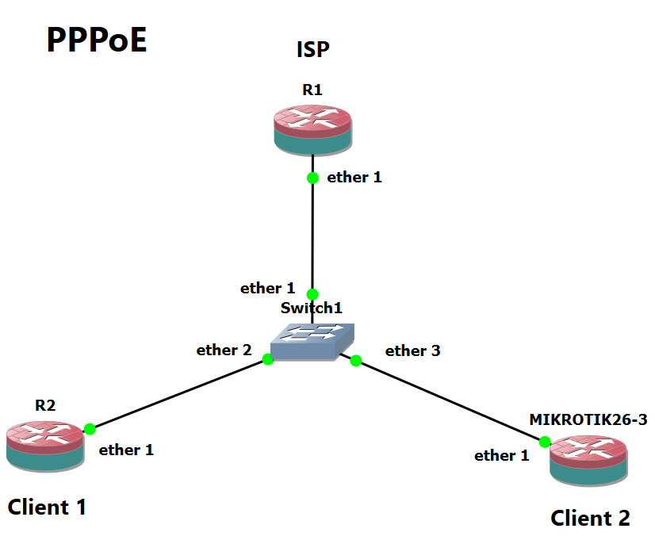
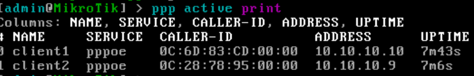
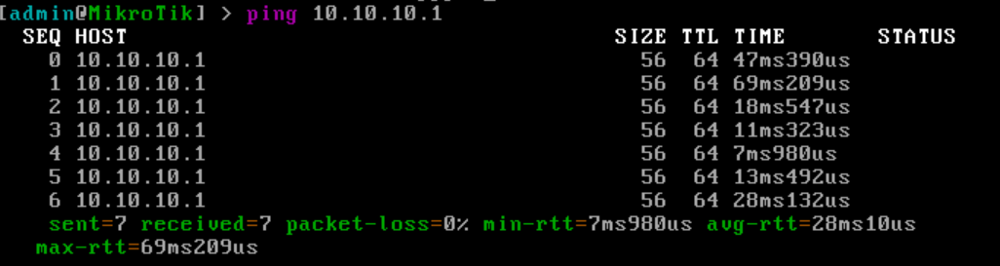
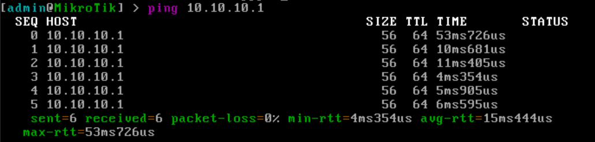

# Lab 03 — PPPoE Server dan Client pada MikroTik (GNS3)

## 1. Tujuan

Mengonfigurasi MikroTik sebagai PPPoE server (router ISP) yang melayani dua PPPoE client (router pelanggan). Setiap pelanggan masuk dengan akun sendiri dan mendapat alamat IP otomatis dari pool.

Perangkat yang dipakai: 3 router MikroTik (R-ISP, R-Client1, R-Client2) dan 1 switch.

> Konfigurasi dilakukan lewat console GNS3. Akses via Winbox dibahas di lab tersendiri.

## 2. Topologi



| Dari | Ke |
| --- | --- |
| R-ISP `ether1` | Switch1 |
| R-Client1 `ether1` | Switch1 |
| R-Client2 `ether1` | Switch1 |

Switch dipakai agar satu PPPoE server di satu interface R-ISP bisa melayani kedua client. Tanpa switch, R-ISP membutuhkan dua interface dan dua PPPoE server.

## 3. Rencana Akun dan Alamat

| Item | Nilai |
| --- | --- |
| Nama pool | `pool-pppoe` |
| Range pool | `172.16.0.10` – `172.16.0.100` |
| Nama profile | `profile-pppoe` |
| Alamat lokal R-ISP (`local-address`) | `172.16.0.1` |
| Nama PPPoE server | `isp` (di `ether1` R-ISP) |

| Pelanggan | Router | Username | Password |
| --- | --- | --- | --- |
| Pelanggan 1 | R-Client1 | `pelanggan1` | `contoh1` |
| Pelanggan 2 | R-Client2 | `pelanggan2` | `contoh2` |

Password di atas hanya contoh untuk lab. Karena repo ini publik, jangan pernah memakai password asli, dan gunakan `/export hide-sensitive` kalau mengekspor konfigurasi.

## 4. Informasi Umum

| Item | Nilai |
| --- | --- |
| Versi RouterOS | 7.21.5 |
| Layanan | PPPoE |
| Jumlah pelanggan | 2 |

## 5. Konsep Singkat

PPPoE (*Point-to-Point Protocol over Ethernet*) membuat koneksi point-to-point virtual di atas jaringan Ethernet. ISP banyak memakainya karena setiap pelanggan harus **login dengan akun sendiri**, sehingga ISP tahu siapa yang terhubung, bisa memberi alamat IP otomatis, dan bisa mengatur layanan per pelanggan.

Komponen di router ISP:

- **IP pool**: kumpulan alamat IP yang dipinjamkan ke pelanggan.
- **PPP profile**: aturan yang dipakai sesi, misalnya alamat lokal (sisi ISP) dan pool untuk alamat pelanggan.
- **PPP secret**: akun pelanggan (username dan password). Satu pelanggan satu secret.
- **PPPoE server**: layanan yang mendengarkan koneksi di sebuah interface.

Di router pelanggan cukup satu komponen: **PPPoE client**, yang berisi username dan password akunnya.

Setelah login berhasil, kedua sisi mendapat alamat di link PPP. Di sisi client muncul interface virtual `pppoe-out1`, dan di sisi server muncul interface dinamis untuk setiap pelanggan yang sedang aktif.

## 6. Konfigurasi

Perintah dijalankan di terminal MikroTik masing-masing router. Versi lengkapnya ada di [`configs/r-isp.rsc`](configs/r-isp.rsc), [`configs/r-client1.rsc`](configs/r-client1.rsc), dan [`configs/r-client2.rsc`](configs/r-client2.rsc).

### a. Router R-ISP (PPPoE server)

Urutannya penting, karena profile memakai pool dan secret memakai profile. Kalau urutannya terbalik, perintah ditolak.

**Nama router**

```routeros
/system identity set name=R-ISP
```

**1) Membuat pool alamat IP**

```routeros
/ip pool add name=pool-pppoe ranges=172.16.0.10-172.16.0.100
```

Menentukan rentang IP yang akan dipinjamkan ke pelanggan.

**2) Membuat PPP profile**

```routeros
/ppp profile add name=profile-pppoe local-address=172.16.0.1 remote-address=pool-pppoe
```

`local-address` adalah alamat R-ISP di setiap link PPP, dan `remote-address` menunjuk pool tempat alamat pelanggan diambil.

**3) Membuat akun pelanggan (PPP secret)**

```routeros
/ppp secret add name=pelanggan1 password=contoh1 service=pppoe profile=profile-pppoe
/ppp secret add name=pelanggan2 password=contoh2 service=pppoe profile=profile-pppoe
```

Satu akun untuk satu pelanggan. Dengan akun terpisah, ISP bisa melihat siapa yang terhubung dan nanti bisa mengatur layanan per pelanggan.

**4) Membuat PPPoE server**

```routeros
/interface pppoe-server server add service-name=isp interface=ether1 default-profile=profile-pppoe disabled=no
```

Server dibuat di `ether1`. Parameter `disabled=no` ditulis eksplisit karena server yang dibuat lewat CLI bisa berstatus nonaktif (lihat [troubleshooting](#9-troubleshooting)).

### b. Router R-Client1 (PPPoE client)

```routeros
/system identity set name=R-Client1
/interface pppoe-client add name=pppoe-out1 interface=ether1 user=pelanggan1 password=contoh1 disabled=no
```

- `interface` adalah interface yang menuju sisi ISP (lewat switch).
- `user` dan `password` harus persis sama dengan secret di R-ISP.

### c. Router R-Client2 (PPPoE client)

```routeros
/system identity set name=R-Client2
/interface pppoe-client add name=pppoe-out1 interface=ether1 user=pelanggan2 password=contoh2 disabled=no
```

Konfigurasinya sama dengan R-Client1, hanya username dan password yang berbeda.

## 7. Verifikasi

### a. Konfigurasi di R-ISP

```routeros
/ppp profile print
/ppp secret print
/interface pppoe-server server print
```


Pada `pppoe-server server print`, pastikan tidak ada flag `X` di depan baris server. Flag `X` berarti server nonaktif.

### b. Status client

Di R-Client1 dan R-Client2:

```routeros
/interface pppoe-client print
/ip address print
```

Tanda berhasil: interface `pppoe-out1` berflag `R` (*running*), dan muncul alamat dinamis (flag `D`) pada interface `pppoe-out1`, diambil dari `pool-pppoe`.

**R-Client1**


**R-Client2**


### c. Sesi aktif di R-ISP

```routeros
/ppp active print
```



Harus muncul dua sesi aktif, yaitu `pelanggan1` dan `pelanggan2`, masing-masing dengan alamat IP berbeda dari pool.

### d. Ping ke sisi ISP

Dari masing-masing client:

```routeros
/ping 172.16.0.1
```





Ping ke `172.16.0.1` (alamat lokal R-ISP) berhasil tanpa static route, karena alamat di link PPP otomatis menjadi *connected route*.

## 8. Catatan: Route Belum Dipakai

Lab ini hanya membuktikan bahwa sesi PPPoE terbentuk. PC dan static route untuk LAN pelanggan belum dipakai, dan akan dibahas di lab berikutnya, di mana jalur ke luar jaringan memang dibutuhkan.

## 9. Troubleshooting

| Gejala | Kemungkinan penyebab | Cek dan solusi |
| --- | --- | --- |
| Client tidak connect, server berflag `X` | PPPoE server nonaktif | `/interface pppoe-server server enable [find service-name=isp]`, atau tulis `disabled=no` saat membuatnya |
| `input does not match any value of profile` saat membuat secret | Profile belum ada di router tempat perintah dijalankan, nama tidak cocok, atau pool belum dibuat sebelum profile | `/ppp profile print` di router yang sama, pastikan pool dibuat lebih dulu, dan ketik nama dengan Tab agar tidak salah |
| Log client: `authentication failed` | Username atau password tidak cocok dengan secret | Samakan `user` dan `password` di client dengan secret di R-ISP |
| Log client: `timeout` | Client belum tersambung ke server | Cek kabel di GNS3, interface yang dipilih, dan switch |
| Hanya satu pelanggan yang bisa login | Secret kedua belum dibuat, atau user salah | `/ppp secret print` di R-ISP |
| Client connect tapi tidak dapat IP | Pool kosong atau profile tidak menunjuk pool | `/ppp profile print` dan `/ip pool print` |

Untuk melihat penyebab kegagalan di client:

```routeros
/log print where topics~"pppoe"
```

## 10. Kesimpulan

PPPoE server pada R-ISP berhasil dikonfigurasi dan melayani dua client dengan akun terpisah. Setiap client login dengan akunnya sendiri, mendapat alamat IP otomatis dari pool, dan dapat berkomunikasi dengan sisi ISP lewat link PPP. Lab ini menjadi dasar untuk lab berikutnya, yaitu menghubungkan jaringan pelanggan dan akses ke luar jaringan.
