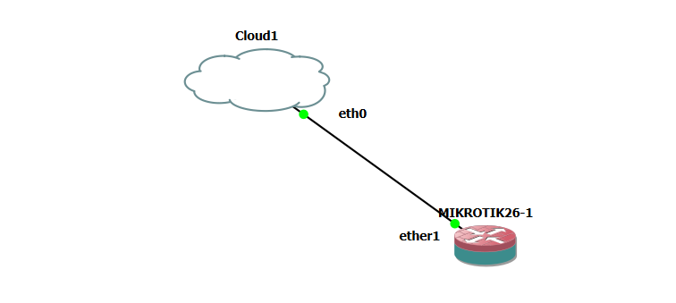
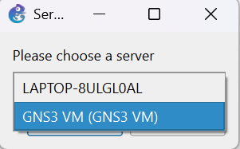
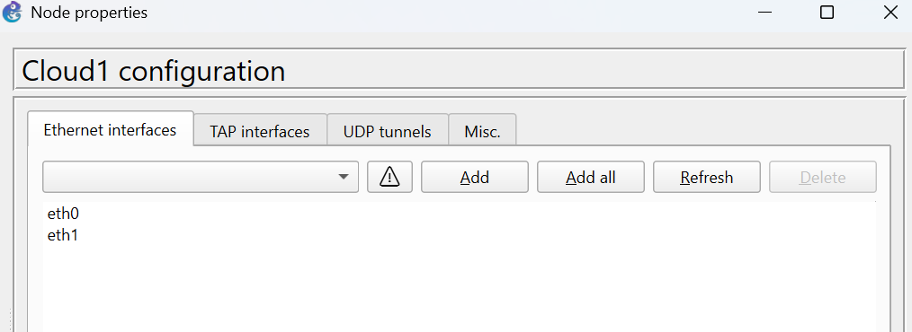
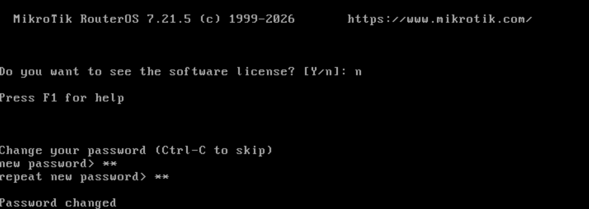
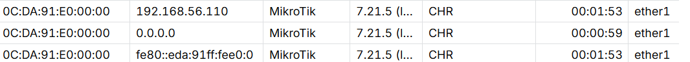
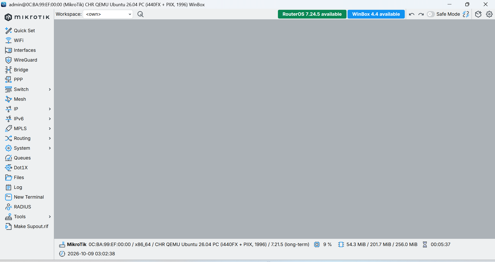

# Lab 04 — Akses Router MikroTik dengan Winbox (GNS3)

## 1. Tujuan

Mengakses router MikroTik di GNS3 dari laptop menggunakan Winbox, lewat node Cloud yang dijalankan di GNS3 VM.

Perangkat yang dipakai: 1 router MikroTik dan 1 node Cloud.

## 2. Persiapan di Laptop

Siapkan Winbox di laptop sebelum membuat topologi. Unduh dari situs resmi MikroTik (menu Download), lalu pastikan aplikasinya bisa dibuka.

## 3. Topologi



| Dari | Ke |
| --- | --- |
| Router `ether1` | Cloud1 |

Jalur koneksinya: laptop (Winbox), adapter host-only VirtualBox, GNS3 VM, node Cloud, lalu router. Winbox tidak terhubung langsung ke router, melainkan lewat GNS3 VM.

## 4. Informasi Umum

| Item | Nilai |
| --- | --- |
| Versi GNS3 server | 2.2.61 |
| Versi RouterOS | 7.21.5 |
| Server node Cloud | GNS3 VM |

## 5. Langkah-Langkah

### a. Menambahkan Cloud ke GNS3 VM

Tambahkan node **Cloud** ke topologi. Jika GNS3 menanyakan server tempat node dijalankan, pilih **GNS3 VM**, karena yang menjembatani ke jaringan laptop adalah interface milik VM.



### b. Menyesuaikan interface Ethernet Cloud

Klik kanan Cloud, pilih **Configure**, lalu pada tab Ethernet interfaces pilih interface yang terhubung ke jaringan host-only (VM berada di alamat `192.168.56.x`), dan tambahkan. Jangan pilih interface NAT, karena laptop tidak berada di jaringan itu.



### c. Menghubungkan router ke Cloud

Sambungkan kabel dari `ether1` router ke Cloud, lalu pilih interface yang tadi ditambahkan.

### d. Menyalakan router dan mengatur password

1. Klik **Start** pada router agar perangkatnya menyala.
2. Buka **console** router.
3. Login dengan user `admin`. Password awalnya kosong, cukup tekan Enter.
4. Saat RouterOS meminta password baru, isi password yang kamu inginkan.



### e. Membuka Winbox

Buka Winbox di laptop, lalu masuk ke tab **Neighbors**. Router akan muncul di daftar beserta MAC address-nya.

### f. Connect ke router

Klik MAC address router di daftar Neighbors, isi login `admin` dan password yang tadi dibuat, lalu klik **Connect**.



Setelah terhubung, jendela Winbox menampilkan menu konfigurasi router. Sampai di sini, router sudah bisa dikelola lewat Winbox.



## 6. Jika Router Tidak Muncul

| Gejala | Kemungkinan penyebab |
| --- | --- |
| Neighbors kosong | Router belum di-start, atau kabel ke Cloud belum tersambung |
| Neighbors kosong | Interface Cloud yang dipilih salah (misalnya interface NAT) |
| Neighbors kosong | Adapter host-only di laptop tidak aktif |
| Router muncul tapi gagal login | Password salah |

Kalau router tetap tidak muncul di Neighbors, beri IP lewat console, lalu connect memakai alamat IP di Winbox (isi kolom Connect To dengan IP-nya):

```routeros
/ip address add address=192.168.56.10/24 interface=ether1
```

Alamat harus satu subnet dengan adapter host-only di laptop (cek lewat `ipconfig`).

## 7. Kesimpulan

Router MikroTik di GNS3 berhasil diakses dari laptop lewat Winbox, dengan Cloud sebagai jembatan ke jaringan host-only GNS3 VM. Lab ini menjadi dasar untuk lab berikutnya yang memerlukan akses ke router dari luar GNS3.
