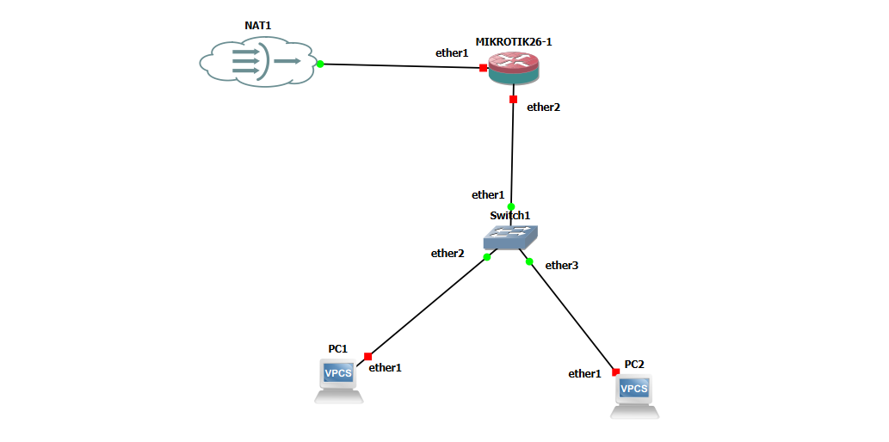
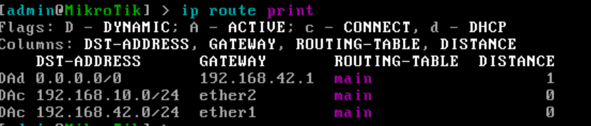
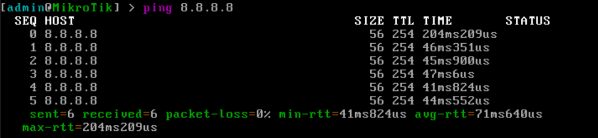

# Lab 05 — NAT dan Akses Internet pada MikroTik (GNS3)

## 1. Tujuan

Membuat PC di jaringan lab bisa mengakses internet melalui router MikroTik dengan NAT masquerade, memakai node NAT di GNS3 sebagai pintu keluar.

Perangkat yang dipakai: 1 node NAT, 1 router MikroTik (R-Gateway), 1 switch, dan 2 VPCS (PC1 dan PC2).

> Konfigurasi dilakukan lewat console GNS3. Akses via Winbox dibahas di [Lab 04](../04-akses-winbox/README.md).

## 2. Topologi



| Dari | Ke |
| --- | --- |
| Node NAT | R-Gateway `ether1` |
| R-Gateway `ether2` | Switch1 |
| Switch1 | PC1 |
| Switch1 | PC2 |

## 3. Rencana Alamat

| Perangkat | Interface | Alamat | Keterangan |
| --- | --- | --- | --- |
| R-Gateway | ether1 | Otomatis dari node NAT | DHCP client (sisi internet) |
| R-Gateway | ether2 | 192.168.10.1/24 | Gateway LAN |
| PC1 | eth0 | 192.168.10.10/24 | Gateway 192.168.10.1, DNS 8.8.8.8 |
| PC2 | eth0 | 192.168.10.11/24 | Gateway 192.168.10.1, DNS 8.8.8.8 |

## 4. Informasi Umum

| Item | Nilai |
| --- | --- |
| Versi GNS3 server | 2.2.61 |
| Versi RouterOS | 7.21.5 |
| Node NAT | Berjalan di GNS3 VM |
| Jaringan LAN | `192.168.10.0/24` |
| DNS di PC | `8.8.8.8` |

## 5. Konsep Singkat

- **Alamat privat dan NAT.** Alamat `192.168.10.x` adalah alamat privat yang tidak dikenali di internet. Dengan NAT masquerade, router mengganti alamat sumber paket dari LAN dengan alamat `ether1` miliknya saat paket keluar, sehingga balasan dari internet bisa kembali ke router, lalu diteruskan ke PC yang meminta.
- **Default route.** Agar router tahu ke mana mengirim paket yang tujuannya di luar jaringan lokal, diperlukan route default (`0.0.0.0/0`). Di lab ini route tersebut ditambahkan otomatis oleh DHCP client.
- **DNS.** Tanpa DNS, PC hanya bisa mengakses alamat IP. Untuk membuka nama domain (misalnya `google.com`), PC perlu tahu alamat DNS server.

## 6. Konfigurasi

Versi lengkap perintah router ada di [`configs/r-gateway.rsc`](configs/r-gateway.rsc).

### a. Node NAT

Tambahkan node **NAT** ke topologi, lalu sambungkan ke `ether1` router. Tidak ada yang perlu dikonfigurasi di node ini. Ia menjembatani lab ke internet lewat GNS3 VM.

### b. Router R-Gateway

**1) Memeriksa DHCP client bawaan di `ether1`**

```routeros
/ip dhcp-client print
/ip address print
```

Router dari template sudah memiliki DHCP client di `ether1` secara bawaan, sehingga langkah ini hanya berupa pemeriksaan. Pastikan statusnya `bound` dan `ether1` sudah mendapat alamat dari node NAT (flag `D`, dinamis).


Mencoba membuat DHCP client baru di `ether1` akan ditolak dengan pesan `dhcp-client on that interface already exist`, karena sudah ada.

**2) Memeriksa default route**

```routeros
/ip route print
```

Harus ada route `0.0.0.0/0` lewat `ether1`, hasil dari DHCP client.



**3) Memberi IP di sisi LAN**

```routeros
/ip address add address=192.168.10.1/24 interface=ether2 comment="LAN PC"
```

Alamat ini menjadi gateway bagi PC.

**4) Membuat NAT masquerade**

```routeros
/ip firewall nat print
```

Tabel NAT pada router dari template masih kosong, jadi aturan masquerade ditambahkan manual:

```routeros
/ip firewall nat add chain=srcnat out-interface=ether1 action=masquerade comment="NAT ke internet"
```

- `chain=srcnat` berarti aturan berlaku untuk paket yang akan keluar dan alamat sumbernya perlu diubah.
- `out-interface=ether1` membatasi aturan pada paket yang keluar lewat sisi internet.
- `action=masquerade` mengganti alamat sumber dengan alamat `ether1` saat itu.

Jalankan perintah ini satu kali saja, karena menjalankannya dua kali membuat aturan ganda.

### c. PC (VPCS)

Alamat di VPCS diatur manual lewat console, termasuk DNS.

```
PC1> ip 192.168.10.10/24 192.168.10.1
PC1> ip dns 8.8.8.8
PC1> save
```

```
PC2> ip 192.168.10.11/24 192.168.10.1
PC2> ip dns 8.8.8.8
PC2> save
```

Perintah `ip dns` menambahkan alamat DNS server, dan `save` menyimpan pengaturan agar tidak hilang saat project dibuka ulang. Cek hasilnya dengan `show ip`.


## 7. Verifikasi

Tes dilakukan bertahap, dari router ke PC. Kalau satu tes gagal, berhenti di situ dan cari penyebabnya sebelum lanjut.

### a. Router ke internet

```routeros
/ping 8.8.8.8
```



Ping berhasil berarti jalur dari router ke luar (node NAT dan default route) berfungsi.

### b. PC ke internet (alamat IP)

```
PC1> ping 8.8.8.8
```


Ping berhasil berarti NAT bekerja: paket dari `192.168.10.10` diterjemahkan dan balasannya kembali ke PC.

### c. PC ke internet (nama domain)

```
PC1> ping google.com
```


Ping ke nama domain berhasil berarti DNS di VPCS juga berfungsi.

### d. Bukti NAT bekerja

```routeros
/ip firewall nat print stats
```


Kolom paket dan byte pada aturan masquerade berisi angka lebih dari 0, yang menandakan paket dari PC melewati aturan NAT.

## 8. Troubleshooting

| Gejala | Kemungkinan penyebab | Cek dan solusi |
| --- | --- | --- |
| `dhcp-client on that interface already exist` saat menambah DHCP client | DHCP client di `ether1` sudah ada bawaan template | Cukup periksa dengan `/ip dhcp-client print`, tidak perlu menambah |
| DHCP client berstatus `searching` | Node NAT belum tersambung atau belum menyala | Cek kabel ke `ether1` dan pastikan node NAT berjalan |
| Router tidak bisa ping `8.8.8.8` | Tidak ada default route, atau `ether1` belum dapat alamat | `/ip address print` dan `/ip route print` |
| PC bisa ping router, tapi tidak bisa ping `8.8.8.8` | Aturan masquerade belum ada atau `out-interface` salah | `/ip firewall nat print` |
| PC bisa ping `8.8.8.8`, tapi tidak bisa ping nama domain | DNS di VPCS belum diisi | `ip dns 8.8.8.8` di PC, lalu `show ip` |
| PC tidak bisa ping gateway | IP atau gateway di VPCS salah, atau `ether2` belum diberi IP | `show ip` di PC dan `/ip address print` di router |
| Tidak ada aturan NAT, atau aturan ganda | Perintah masquerade belum dijalankan atau dijalankan dua kali | `/ip firewall nat print`, hapus yang dobel |

## 9. Kesimpulan

PC di jaringan `192.168.10.0/24` berhasil mengakses internet lewat R-Gateway. Router mendapat alamat dan default route dari node NAT, aturan masquerade menerjemahkan alamat privat PC ke alamat `ether1`, dan DNS di VPCS membuat nama domain bisa diakses. Lab ini menjadi dasar untuk lab berikutnya yang memerlukan akses keluar jaringan.
